Retail Sales Data Warehouse | End-to-End ETL Pipeline
Engineering Lead: Omar Essam

---

Tech Stack
- Database: PostgreSQL
- Language: SQL (Advanced: CTEs, Window Functions, Pattern Matching)
- Architecture: Data Modeling (Star Schema Design)
- Core Skills: ETL Pipeline Design, Data Cleaning, & Transformation
- Analytics: Business Intelligence Concepts (RFM, Cohort Analysis)

---

Project Overview
This project demonstrates a complete Data Engineering lifecycle, transforming raw and inconsistent retail data into a structured PostgreSQL Data Warehouse.

The pipeline follows a full **ETL approach**, resulting in a clean **Star Schema** optimized for analytical queries, KPI reporting, and advanced business insights.

---

Architecture Flow

```text
Raw Data
   ↓
Data Cleaning
   ↓
Standardization
   ↓
Star Schema Modeling
   ↓
Analytics Layer
   ↓
Business Insights
```

---

Phase 1: Data Auditing & Cleaning
The goal of this phase was to ensure data reliability and consistency before modeling.

---

1.1 Initial Profiling & Identification
Defined the core schema by creating raw staging tables: `customer`, `fact_table`, `item`, `store`, `time`, and `trans` — each with TEXT-typed columns to ingest data as-is before any transformation.

<p align="center">
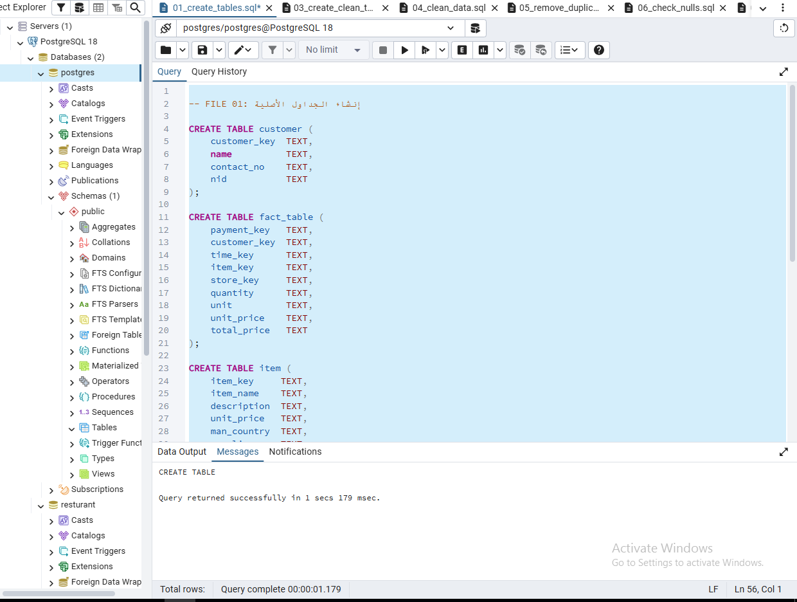
</p>

---

1.2 Handling Missing Data
Created clean staging copies of all source tables using `CREATE TABLE ... AS SELECT * FROM`, preserving the full dataset structure as a base for transformation in subsequent steps.

<p align="center">
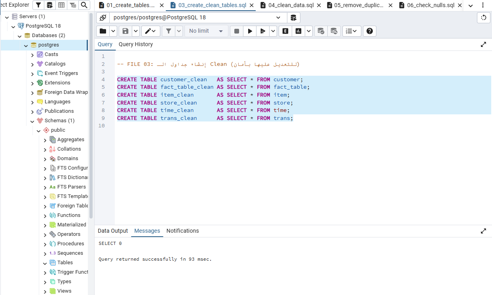
</p>

---

1.3 Data Standardization
Applied `TRIM`, `INITCAP`, and `REGEXP_REPLACE` to normalize text fields across all clean tables. Used `NULLIF` to convert empty strings to NULL, ensuring consistent and query-ready data.

<p align="center">
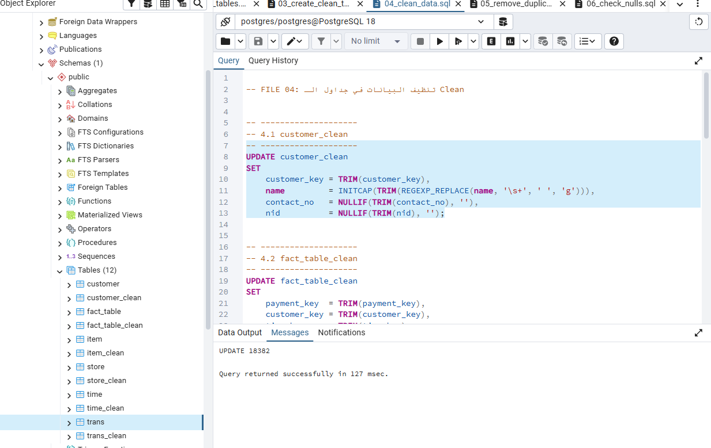
</p>

---

1.4 Duplicate Removal
Leveraged the PostgreSQL `ctid` system column with `ROW_NUMBER()` to identify and delete duplicate records, keeping only the first occurrence per key — applied across `customer_clean` and `item_clean`.

<p align="center">
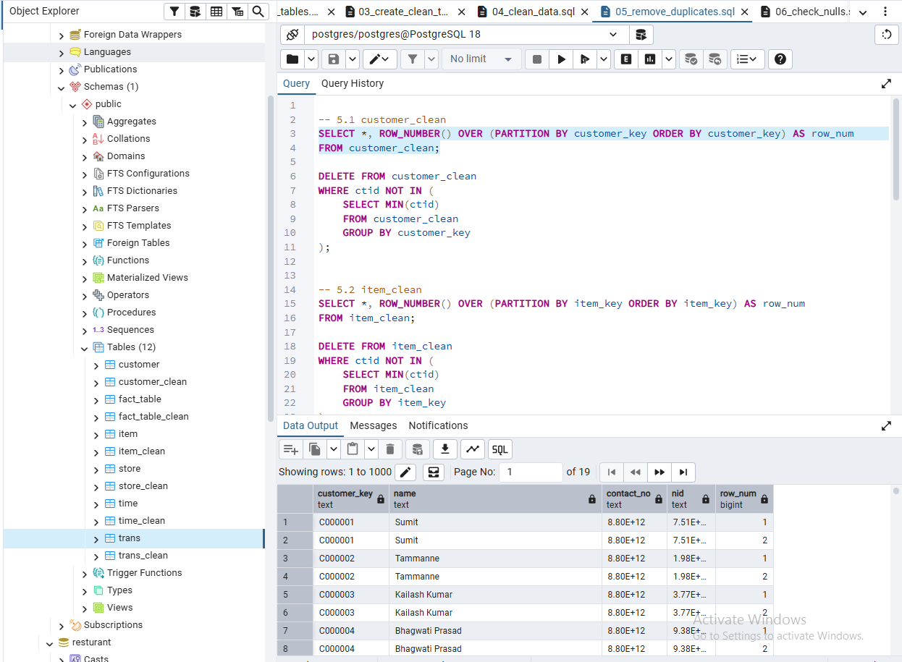
</p>

---

1.5 Data Profiling & Null Value Management
In this phase, a comprehensive audit was performed on the numeric and text columns within the `item_clean` and `fact_table_clean` tables to identify data quality gaps.

**Key Operations Performed:**

- **Data Profiling:** Utilized the `COUNT` function to compare total rows against non-null entries for columns like `item_key`, `item_name`, and `description` to calculate exact null counts.
- **Handling Missing Data:** Executed an `UPDATE` statement to replace critical missing values in the `item_name` column with the placeholder `'Unknown'`.

<p align="center">
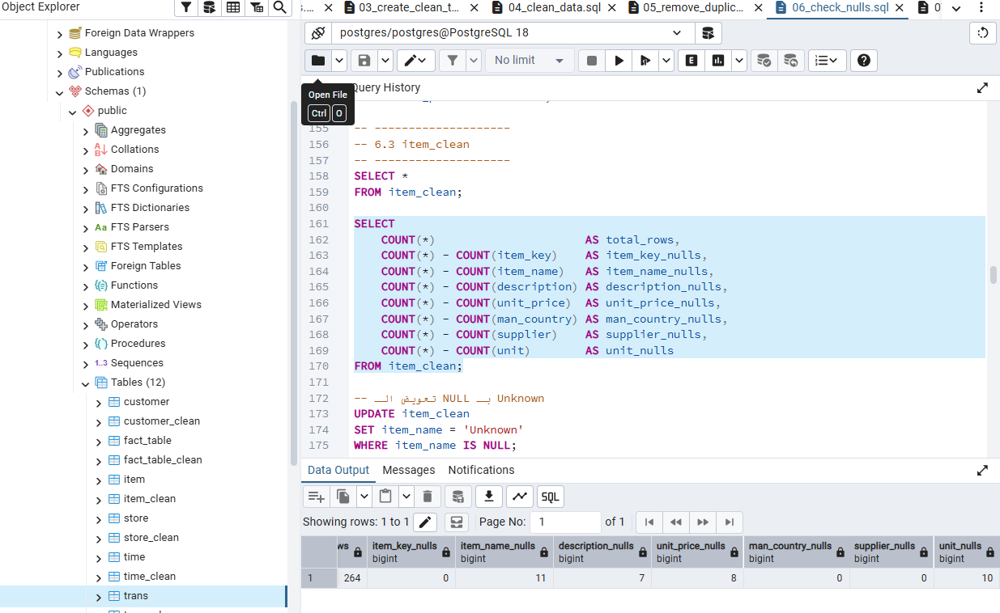
</p>

- **Data Quality Profiling:** Using `COUNT(*)` minus `COUNT(column_name)` to identify the exact volume of missing values (NULLs) across multiple dimensions like `item_key`, `item_name`, and `description`.
- **Missing Value Strategy:** Executing an `UPDATE` command to replace NULLs in critical descriptive fields with a standard `'Unknown'` placeholder.
- **Statistical Foundation:** Calculating `MIN`, `MAX`, and `AVG` for numeric columns to establish the baseline needed for IQR (Interquartile Range) outlier detection.

<p align="center">
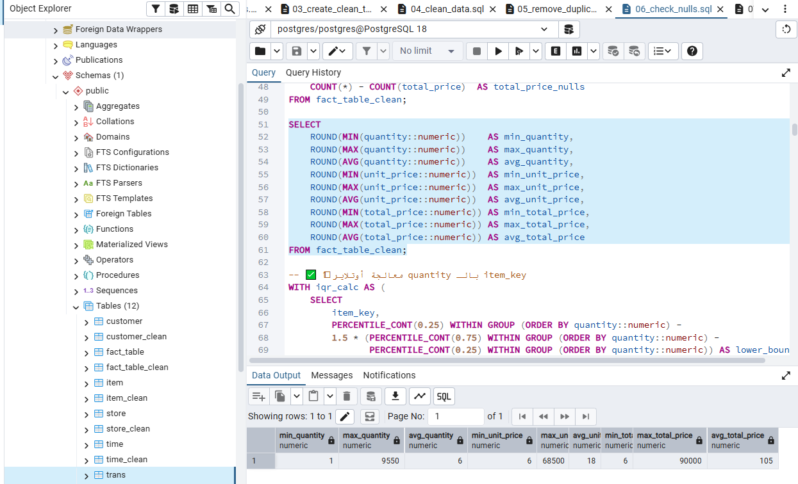
</p>

---

Phase 2: Data Modeling (Star Schema)
Building a scalable analytical environment using a Star Schema architecture.

---

2.1 Table Creation & Optimization
Transitioning from staging tables to final tables while optimizing data types for faster query execution.

**Key Data Operations:**

- **Outlier Neutralization:** Replaced extreme outlier values in the `quantity` column using IQR (Interquartile Range) bounds calculated via Common Table Expressions (CTEs).
- **Missing Value Imputation:** Filled NULL quantities with per-item average values to ensure completeness without distorting overall trends.
- **Schema Finalization:** Cleaned and validated the `fact_table_clean` before promoting it to the core Star Schema layer.

<p align="center">
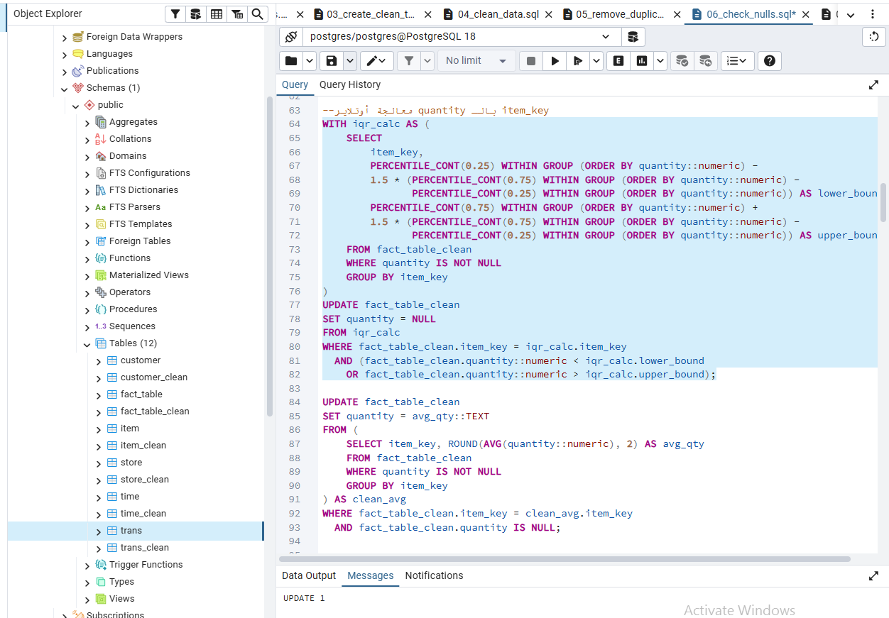
</p>

---

2.2 Schema Architecture & Integrity
**Data Quality Auditing:** Performing a comprehensive null check on the `time_clean` table — calculating total rows and identifying missing values across all time-related columns (`date`, `hour`, `day`, `week`, `month`, `quarter`, `year`) to verify data integrity before final transformation.

**Temporal Feature Engineering:** Rebuilding time features by extracting `hour`, `day`, `month`, `quarter`, and `year` from the raw date string using `TO_TIMESTAMP` and `EXTRACT`. A `CASE` statement is used to categorize dates into labeled week-of-month buckets (`'1st Week'`, `'2nd Week'`, `'3rd Week'`, `'4th Week'`).

<p align="center">
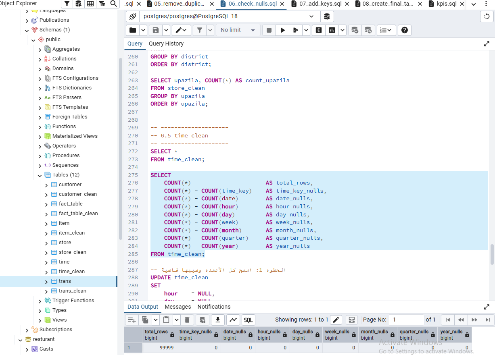
</p>

Data Parsing: Converts raw date strings into standard PostgreSQL timestamps using TO_TIMESTAMP to ensure temporal accuracy.

Feature Extraction: Utilizes the EXTRACT function to isolate specific attributes, including Year, Month, Day, and Hour.

Quarterly Categorization: Dynamically generates fiscal quarters (e.g., Q1, Q2) by concatenating the extracted quarter integer with a 'Q' prefix.

Weekly Cycle Logic: Implements a CASE statement with a modulo operator (% 4) to categorize ISO weeks into a recurring 4-week monthly cycle (1st Week through 4th Week).

Analysis Use Case:
This transformation enables advanced business insights, such as identifying peak sales hours, comparing quarterly performance, and analyzing weekly consumer behavior trends.

<p align="center">
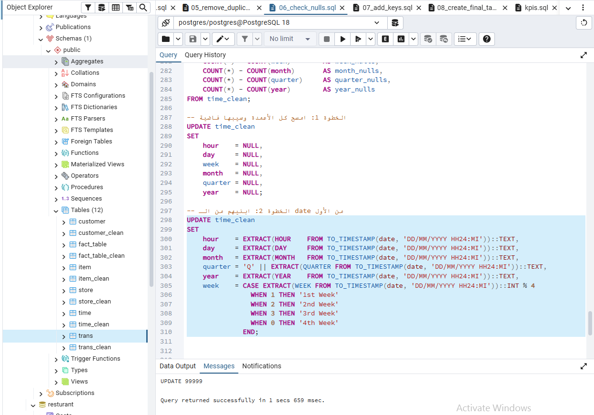
</p>

---

Phase 3: Business Intelligence & Advanced Analytics
Transforming the cleaned data into high-value executive insights.

---

3.1 Schema Integrity & Star Schema Finalization

**1. Defining Primary Keys (The Blue Section)**

- **Goal:** To uniquely identify every row in your dimension tables.
- **Action:** It sets columns like `customer_key`, `item_key`, and `store_key` as Primary Keys.
- **Effect:** This ensures that you don't have duplicate records for the same customer or product, and it significantly speeds up data retrieval (searching).

**2. Defining Foreign Keys (The Bottom Section)**

- **Goal:** To create a formal link between your "Fact Table" (where the sales happen) and your "Dimension Tables" (where the details live).
- **Action:** It adds Foreign Key constraints to the `fact_table_final`. For example:
  - The `customer_key` in the Fact Table must exist in the `customer_final` table.
  - The `item_key` in the Fact Table must exist in the `item_final` table.
- **Relationship:** This creates the "Star" in your Star Schema, where the Fact Table sits in the center, connected to all the descriptive dimensions (Customer, Item, Store, Time, Trans).

<p align="center">
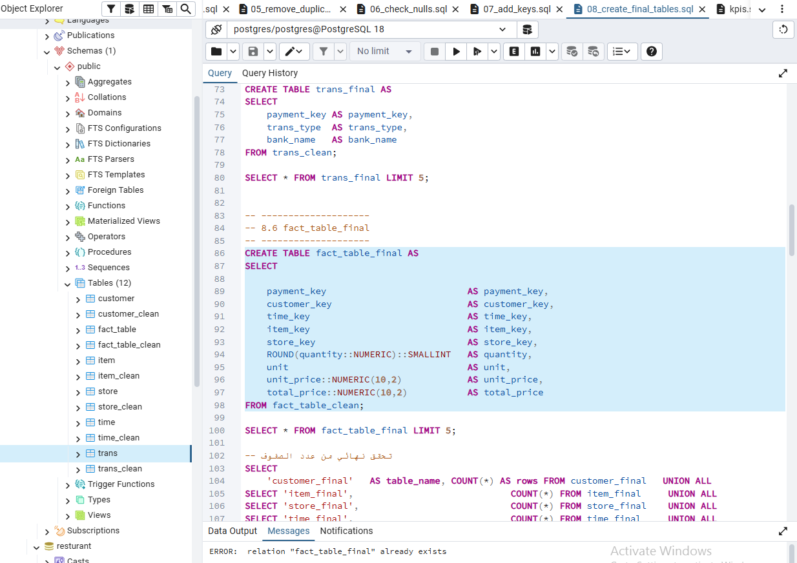
</p>

---

3.2 Sales Performance KPIs
Calculated core sales metrics from `fact_table_final`: total revenue via `SUM(total_price)`, average order value via `AVG(total_price)`, and total units sold via `SUM(quantity)`.
Business Impact: Established the monetary baseline for evaluating customer value and product performance.

<p align="center">
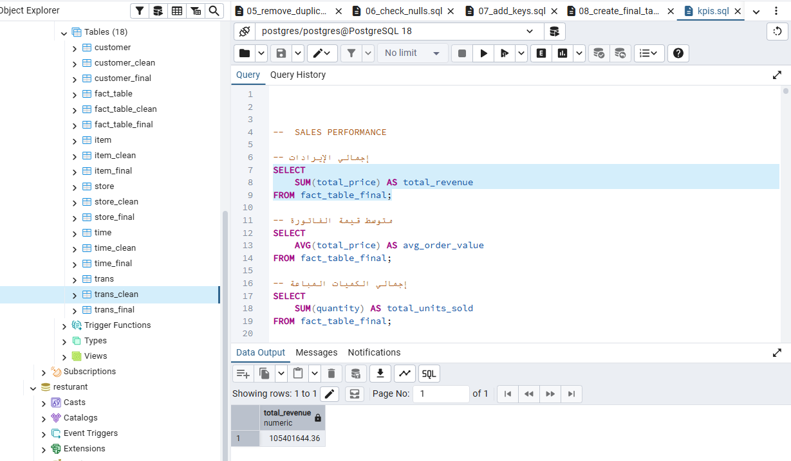
</p>

---

3.3 Financial & Growth KPIs

**Quarterly Revenue Analysis:** Computed quarterly revenue by joining `fact_table_final` with `time_final`, grouped by `year` and `quarter`.

**Top Products Ranking:**

- **`SUM(f.quantity)`:** Calculates the total number of units sold for each item.
- **`JOIN item_final`:** Connects sales records to the product details table to retrieve actual item names instead of ID numbers.
- **`WHERE i.item_name <> 'Unknown'`:** Filters out unidentifiable records to ensure report accuracy.
- **`ORDER BY total_units_sold DESC LIMIT 10`:** Returns only the top 10 best-selling products.

<p align="center">
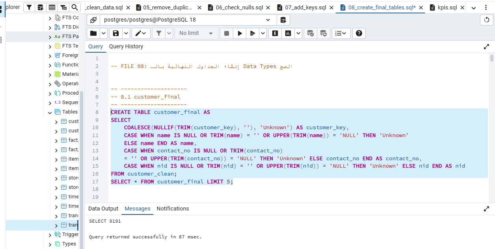
</p>

**Month-over-Month (MoM) Revenue Growth:**

This analysis performs a Time-Series calculation using a `monthly` CTE with the `LAG()` Window Function:

- **`WITH monthly AS (...)`:** Joins `fact_table_final` with `time_final` and aggregates `SUM(total_price)` for every unique `year` and `month` combination.
- **`LAG(revenue)`:** Fetches the revenue from the preceding month for direct comparison, labeled as `prev_month_revenue`.
- **Growth Formula:** `(Current Month - Previous Month) / Previous Month × 100`, rounded to 2 decimal places.
- **Note:** The first month returns `[null]` for `prev_month_revenue` as expected — no prior period exists to compare against.

<p align="center">
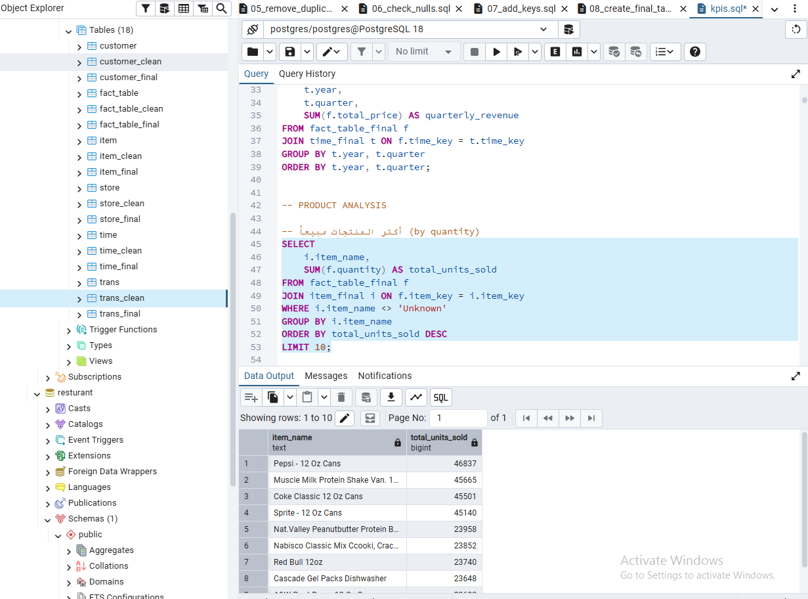
</p>

---

3.4 Advanced Cohort Analysis

This analysis groups customers based on when they made their first purchase and tracks how many returned in subsequent months.

**The First CTE: `first_purchase`**
- Finds the "birth date" of each customer using `MIN(date)` per `customer_key`.
- Formats the result as `YYYY-MM` using `LPAD` and string concatenation to establish the **Cohort Month**.

**The Second CTE: `purchases`**
- Maps every transaction to its specific `purchase_month` in `YYYY-MM` format — listing all months each customer was active.

**The Third CTE: `cohort_data`**
- Joins the two previous CTEs on `customer_key`.
- Groups by `cohort_month` and `purchase_month`.
- Uses `COUNT(DISTINCT customer_key)` to measure unique active customers per cohort-to-purchase month combination.

**Business Impact:** Forms the foundation for a full Retention Heatmap — answering questions like "Of the customers who joined in January, how many were still buying in June?"


<p align="center">
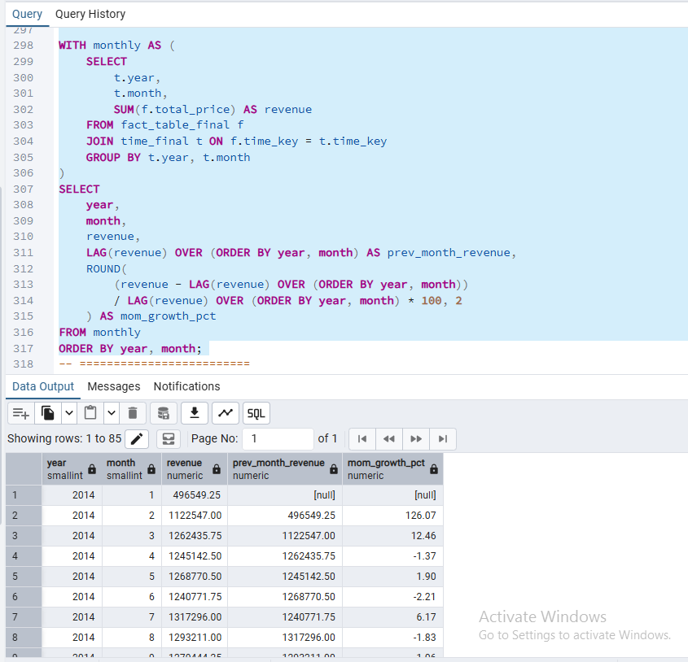
</p>

---

3.5 The Final Product
A preview of the cohort analysis output — showing active customer counts per cohort month from 2014 onward. The fully cleaned and modeled dataset is now ready for BI tools and executive reporting.

<p align="center">
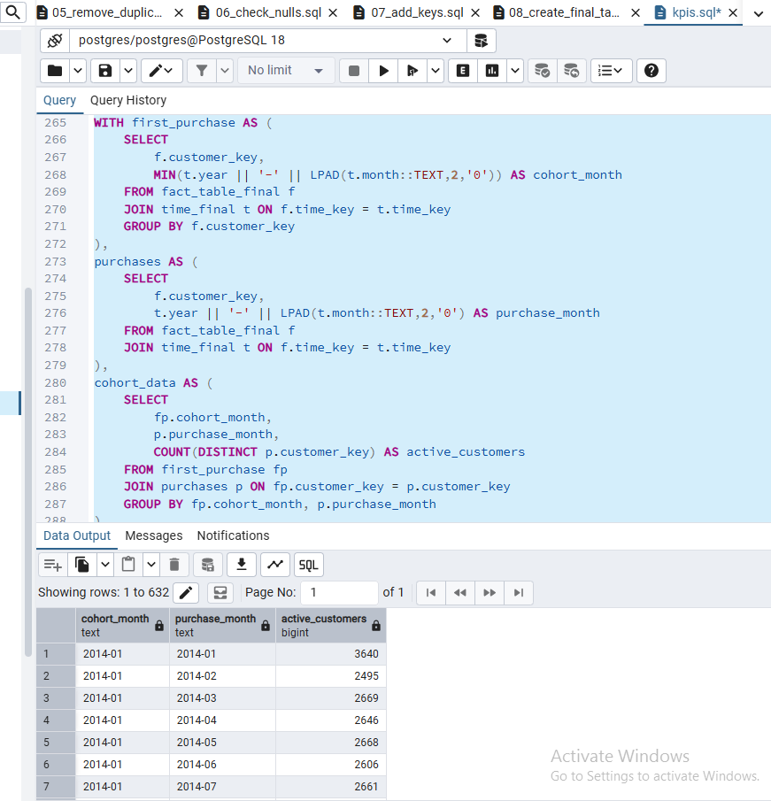
</p>

---

Challenges Faced & Solved

- **Referential Integrity:** Handling missing values in ID columns without breaking table joins.
- **Data Inflation:** Preventing duplicate records from inflating revenue and transaction KPIs.
- **Performance:** Optimizing complex analytical queries (Cohorts/RFM) for faster execution.

---

About the Author
Omar Essam

- Business Information Systems – Tanta University
- 
