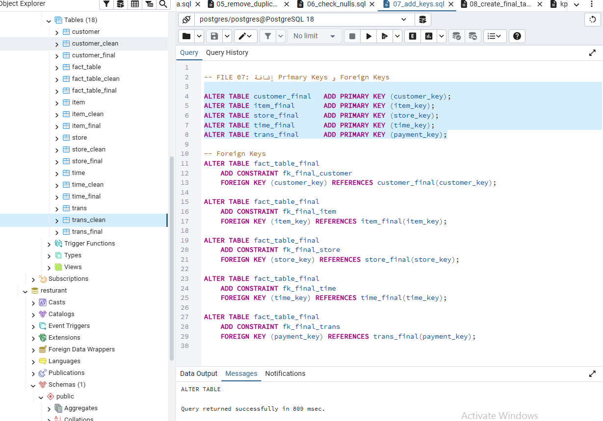

Retail Sales Data Warehouse | End-to-End ETL Pipeline
Engineering Lead: Omar Essam

---

Tech Stack
- Database: PostgreSQL
- Language: SQL (Advanced: CTEs, Window Functions, Pattern Matching)
- Architecture: Data Modeling (Star Schema Design)
- Core Skills: ETL Pipeline Design, Data Cleaning, & Transformation
- Analytics: Business Intelligence Concepts (RFM, Cohort Analysis)

---

Project Overview
This project demonstrates a complete Data Engineering lifecycle, transforming raw and inconsistent retail data into a structured PostgreSQL Data Warehouse.

The pipeline follows a full **ETL approach**, resulting in a clean **Star Schema** optimized for analytical queries, KPI reporting, and advanced business insights.

---

Architecture Flow

```text
Raw Data
   ↓
Data Cleaning
   ↓
Standardization
   ↓
Star Schema Modeling
   ↓
Analytics Layer
   ↓
Business Insights
```

---

Phase 1: Data Auditing & Cleaning
The goal of this phase was to ensure data reliability and consistency before modeling.

---

1.1 Initial Profiling & Identification
Defined the core schema by creating raw staging tables: `customer`, `fact_table`, `item`, `store`, `time`, and `trans` — each with TEXT-typed columns to ingest data as-is before any transformation.

<p align="center">

</p>

---

1.2 Handling Missing Data
Created clean staging copies of all source tables using `CREATE TABLE ... AS SELECT * FROM`, preserving the full dataset structure as a base for transformation in subsequent steps.

<p align="center">

</p>

---

1.3 Data Standardization
Applied `TRIM`, `INITCAP`, and `REGEXP_REPLACE` to normalize text fields across all clean tables. Used `NULLIF` to convert empty strings to NULL, ensuring consistent and query-ready data.

<p align="center">

</p>

---

1.4 Duplicate Removal
Leveraged the PostgreSQL `ctid` system column with `ROW_NUMBER()` to identify and delete duplicate records, keeping only the first occurrence per key — applied across `customer_clean` and `item_clean`.

<p align="center">

</p>

---

1.5 Outlier Detection & Treatment
Profiled all numeric columns in `item_clean` and `fact_table_clean` using `COUNT`, `MIN`, `MAX`, and `AVG`. Then applied the **IQR (Interquartile Range)** method via `PERCENTILE_CONT(0.25/0.75)` to detect and neutralize extreme outliers in `quantity` and `total_price`.

<p align="center">

</p>

<p align="center">

</p>

---

Phase 2: Data Modeling (Star Schema)
Building a scalable analytical environment using a Star Schema architecture.

---

2.1 Table Creation & Optimization
Replaced outlier `quantity` values using IQR bounds calculated via CTEs, and filled NULL quantities with per-item average values — finalizing `fact_table_clean` before promotion to the Star Schema layer.

<p align="center">

</p>

---

2.2 Schema Architecture & Integrity
Extracted time attributes (`hour`, `day`, `week`, `month`, `quarter`, `year`) from raw timestamps using `TO_TIMESTAMP` and `EXTRACT`, then populated all derived columns in `time_clean` to prepare the time dimension for the Star Schema.

<p align="center">

</p>

Created final production tables (`trans_final`, `fact_table_final`) by selecting and casting numeric columns — `quantity::SMALLINT`, `unit_price::NUMERIC(10,2)`, `total_price::NUMERIC(10,2)` — to enforce proper data types for analytical performance.

<p align="center">

</p>

---

Phase 3: Business Intelligence & Advanced Analytics
Transforming the cleaned data into high-value executive insights.

---

3.1 Schema Integrity & Star Schema Finalization
Established **Primary Keys (PK)** and **Foreign Keys (FK)** across all final tables (`customer_final`, `item_final`, `store_final`, `time_final`, `trans_final`, `fact_table_final`) to enforce referential integrity across the Star Schema.
Business Impact: Guaranteed data consistency and join reliability for all downstream analytical queries.

<p align="center">

</p>

---

3.2 Sales Performance KPIs
Calculated core sales metrics from `fact_table_final`: total revenue via `SUM(total_price)`, average order value via `AVG(total_price)`, and total units sold via `SUM(quantity)`.
Business Impact: Established the monetary baseline for evaluating customer value and product performance.

<p align="center">

</p>

---

3.3 Financial & Growth KPIs
Computed quarterly revenue by joining `fact_table_final` with `time_final`, grouped by `year` and `quarter`. Ranked the top 10 best-selling products by total units sold using `SUM(quantity) ... ORDER BY DESC LIMIT 10`, excluding Unknown items.

<p align="center">

</p>

Used a `monthly` CTE with the `LAG()` Window Function to calculate **Month-over-Month (MoM)** revenue growth percentage across all years — enabling trend detection and performance benchmarking over time.

<p align="center">

</p>

---

3.4 Advanced Cohort Analysis
Built a multi-CTE cohort pipeline: identified each customer's first purchase month using `MIN(t.year || t.month)`, then tracked their purchasing activity across subsequent months to measure active customer counts per cohort over time.
Business Impact: Enabled identification of long-term retention patterns and behavioral trends for strategic marketing decisions.

<p align="center">

</p>

<p align="center">

</p>

---

3.5 The Final Product
A preview of the cohort analysis output — showing active customer counts per cohort month from 2014 onward. The fully cleaned and modeled dataset is now ready for BI tools and executive reporting.

<p align="center">

</p>

---

Challenges Faced & Solved

- **Referential Integrity:** Handling missing values in ID columns without breaking table joins.
- **Data Inflation:** Preventing duplicate records from inflating revenue and transaction KPIs.
- **Performance:** Optimizing complex analytical queries (Cohorts/RFM) for faster execution.

---

About the Author
Omar Essam

- Business Information Systems – Tanta University
